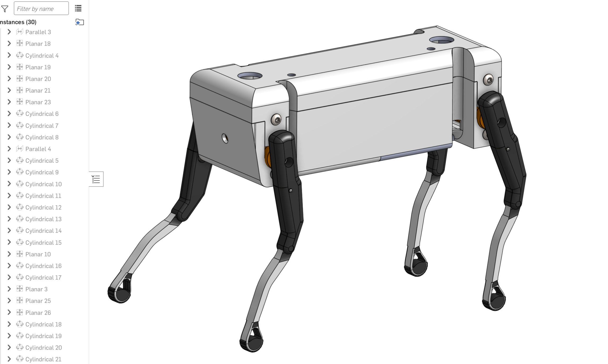

  

<h1 align="center">🤖 Robotic Dog Mechanical Design</h1>

  <strong>Quadruped Robotic Platform • Mechanical Design • CAD Assembly • Exploded View</strong>

  <em>Designed and assembled using Onshape</em>

  <a href="https://cad.onshape.com/documents/4d14c435e506016aea231b14/w/0b3da8133fb8a74c2e13b083/e/b208f103058f48640a897b53?renderMode=0&uiState=6a80d4d25eaba6d1d4f8fe6f">
    🔗 Open Interactive Onshape Model
  </a>
  &nbsp;&nbsp;•&nbsp;&nbsp;
  <a href="./Robotic_Dog_Assembly_Design.pdf">
    📄 Assembly Documentation
  </a>

---

## 📌 Project Overview

This project presents the mechanical design, assembly, and exploded-view analysis of a **quadruped robotic dog** developed in Onshape.

The robot is built around a modular mechanical architecture consisting of a rigid central chassis, four articulated leg assemblies, rotary actuation units, joint interfaces, mounting elements, structural body components, and mechanical fasteners.

The project focuses on two main engineering objectives:

1. Developing a complete and well-organized mechanical assembly for the current robotic dog.
2. Establishing a systematic engineering methodology for designing a **larger robotic dog** while considering structural dimensions, mechanical loads, actuator torque, stability, joint configuration, scalability, and assembly accessibility.

The final CAD model includes a complete **Exploded View sequence** that demonstrates how the major mechanical components are assembled and disassembled.

---

## ✨ Project Highlights

| Feature | Description |
|---|---|
| 🤖 **Robot Type** | Quadruped robotic dog |
| 🧩 **Design Approach** | Modular mechanical architecture |
| 🛠️ **CAD Platform** | Onshape |
| 🦿 **Leg Configuration** | Four articulated leg assemblies |
| ⚙️ **Actuation Concept** | Rotary servo-driven joints |
| 🔩 **Assembly** | Mechanical joints, brackets, fasteners, and body components |
| 💥 **Exploded View** | Sequential assembly and disassembly representation |
| 📈 **Scalability** | Engineering methodology for developing a larger robotic dog |

---

## 🔗 Interactive CAD Model

The complete robotic dog can be inspected directly through the Onshape model.

### 👉 [Open the Robotic Dog in Onshape](https://cad.onshape.com/documents/4d14c435e506016aea231b14/w/0b3da8133fb8a74c2e13b083/e/b208f103058f48640a897b53?renderMode=0&uiState=6a80d4d25eaba6d1d4f8fe6f)

The interactive model provides access to:

- Complete robotic dog assembly
- Individual mechanical components
- Four articulated leg assemblies
- Servo motor locations
- Joint connections
- Structural body components
- Mounting interfaces
- Screws and fasteners
- Exploded View sequence

---

## 🎬 Exploded View Demonstration

The Exploded View demonstrates the relationship between the robotic dog's mechanical components and shows the assembly and disassembly process step by step.

  <strong>🎥 </strong>

https://github.com/user-attachments/assets/d868fca2-5fec-4f14-a35a-fd4e8bc61b02

---

## ⚙️ Mechanical Architecture

The robotic dog is organized into several interconnected mechanical subsystems.

| Subsystem | Engineering Function |
|---|---|
| 🧱 **Main Chassis** | Acts as the primary structural frame and supports the complete robotic system. |
| 🦿 **Leg Assemblies** | Provide articulated support and form the mechanical basis for quadruped locomotion. |
| ⚙️ **Actuation Units** | Generate rotary motion and torque at the primary leg joints. |
| 🔄 **Joint Interfaces** | Transfer actuator motion to the articulated leg mechanisms. |
| 🧩 **Mounting Components** | Secure actuators and structural components while maintaining alignment. |
| 🔩 **Fasteners** | Provide removable mechanical connections for assembly and maintenance. |
| 🛡️ **Body Components** | Support and protect the internal mechanical structure. |

---

## 🎯 Engineering Design Objectives

The mechanical system was developed according to the following engineering objectives:

- Maintain a rigid and mechanically stable central chassis.
- Position the four legs symmetrically around the robot body.
- Maintain balanced mechanical loading between the front and rear sections.
- Position actuators close to the primary joint axes.
- Reduce unnecessary mechanical transmission complexity.
- Maintain sufficient clearance between moving components.
- Provide accessible mounting and fastening locations.
- Use a modular design that simplifies assembly and maintenance.
- Minimize unnecessary structural mass.
- Provide sufficient mechanical strength at major load-bearing locations.
- Create a design architecture that can be scaled to a larger robotic dog.
- Develop a clear and logical assembly/disassembly sequence.

---

# 🧠 Engineering Design Algorithm

## 1. Define the System Requirements

The design process begins by identifying the target specifications of the robotic dog.

### Required Design Inputs

- Robot length
- Robot width
- Standing height
- Desired ground clearance
- Estimated total mass
- Payload requirement
- Upper-leg length
- Lower-leg length
- Number of actuated joints
- Required joint range of motion
- Desired mobility
- Available actuator space
- Available battery space
- Mechanical safety factor

These parameters define the mechanical constraints that guide the remainder of the design process.

---

## 2. Establish the Mechanical Architecture

The complete robotic dog is divided into independent mechanical subsystems:

- Main chassis
- Front-left leg
- Front-right leg
- Rear-left leg
- Rear-right leg
- Actuation units
- Joint interfaces
- Mounting components
- Structural body elements
- Fastening system

This modular approach allows each subsystem to be analyzed, modified, assembled, replaced, and maintained independently.

---

## 3. Estimate the Total Robot Weight

The gravitational force acting on the complete robot can be estimated using:

  <strong>W = m × g</strong>

Where:

- **W** = robot weight in newtons
- **m** = total robot mass in kilograms
- **g** = gravitational acceleration ≈ 9.81 m/s²

The total mass estimate should include:

- Chassis
- Legs
- Servo motors
- Battery
- Controllers
- Sensors
- Wiring
- Mounting components
- Fasteners
- Structural covers

A realistic mass estimate is important because actuator torque and structural loading depend directly on the total robot weight.

---

## 4. Estimate the Load on Each Leg

For an initial static analysis, the approximate load supported by each leg can be estimated using:

  <strong>Fleg = W / n</strong>

Where:

- **Fleg** = approximate force supported by one leg
- **W** = total robot weight
- **n** = number of legs supporting the robot

During walking, all four legs may not support the robot simultaneously.

Therefore, the mechanical system should be evaluated under more conservative conditions where fewer legs temporarily support a larger portion of the total weight.

---

## 5. Calculate the Required Joint Torque

The mechanical torque required at a joint depends on the applied force and its perpendicular distance from the joint axis.

  <strong>τ = F × r</strong>

Where:

- **τ** = required joint torque
- **F** = applied force
- **r** = perpendicular distance from the joint axis

A mechanical safety factor should then be applied:

  <strong>τdesign = τ × SF</strong>

Where:

- **τdesign** = required design torque
- **SF** = selected mechanical safety factor

The selected actuator should satisfy:

  <strong>τactuator ≥ τdesign</strong>

This ensures that the actuator provides sufficient torque for the expected mechanical loading.

---

## 6. Select the Actuation System

The current mechanical architecture uses rotary actuation at the main leg-body joints.

For a larger robotic dog, the actuator should be selected according to:

- Required torque
- Rotational speed
- Joint range of motion
- Robot mass
- Leg dimensions
- Operating voltage
- Power consumption
- Actuator size
- Mechanical mounting compatibility
- Control interface
- Thermal performance
- Expected duty cycle

The actuator should **not** be selected only by increasing the physical size of the existing motor.

The mechanical load and torque requirements must be recalculated first.

---

## 7. Design the Main Chassis

The central chassis acts as the primary structural reference for the entire robot.

The chassis should:

- Support the mechanical load of the robot.
- Provide mounting locations for all four legs.
- Maintain geometric symmetry.
- Provide actuator mounting interfaces.
- Provide space for electronic components.
- Provide space for the battery and control system.
- Protect internal components.
- Allow access for maintenance.
- Maintain adequate structural rigidity.
- Minimize unnecessary mass.

For a larger robot, chassis dimensions and structural thickness should be reviewed based on the increased loading.

---

## 8. Develop the Leg Geometry

Each leg is treated as an articulated mechanical structure.

Important design parameters include:

- Upper-leg length
- Lower-leg length
- Joint positions
- Joint rotation limits
- Ground clearance
- Standing height
- Foot contact position
- Mechanical loading
- Structural rigidity
- Actuator location
- Body clearance

The leg geometry should provide the required workspace without causing mechanical interference with the chassis or adjacent components.

---

## 9. Position the Actuators

Actuators should be positioned as close as practical to the main joint axes.

This helps reduce:

- Mechanical transmission complexity
- Backlash
- Unnecessary structural components
- Added mass
- Alignment errors

The actuator axis should remain accurately aligned with the corresponding mechanical joint axis.

---

## 10. Evaluate the Center of Mass

Heavy components should be positioned near the center of the robot whenever possible.

These components may include:

- Battery
- Actuators
- Controllers
- Power electronics
- Structural supports

A centralized mass distribution improves balance and reduces excessive loading on individual legs.

The center of mass should remain within a stable support region during normal standing and locomotion.

---

## 11. Develop the CAD Components

Each mechanical component is created or imported into the CAD environment.

The following properties are checked:

- Correct dimensions
- Correct mounting-hole locations
- Correct joint geometry
- Correct mechanical interfaces
- Adequate structural thickness
- Correct actuator mounting
- Correct component orientation
- Sufficient mechanical clearance

---

## 12. Build the Mechanical Assembly

The mechanical system is assembled according to the following hierarchy:

  <strong>
    Main Chassis 
    ↓ 
    Actuation Units 
    ↓ 
    Joint Interfaces 
    ↓ 
    Leg Assemblies 
    ↓ 
    Mounting Components 
    ↓ 
    Fasteners 
    ↓ 
    External Body Components
  </strong>

Assembly constraints are applied to preserve the intended mechanical relationships between all components.

---

## 13. Verify Joint Alignment

Each major joint is checked to confirm:

- Correct axis alignment
- Correct rotational direction
- Correct connection to adjacent components
- Proper mechanical positioning
- Absence of unintended offsets
- Sufficient range of motion

Incorrect joint alignment can introduce additional mechanical stress and reduce actuator efficiency.

---

## 14. Perform Clearance and Interference Checks

The completed assembly is inspected for possible mechanical interference.

Critical areas include:

- Leg ↔ Chassis
- Leg ↔ Leg
- Actuator ↔ Chassis
- Fastener ↔ Moving Joint
- Bracket ↔ Leg
- Joint ↔ Structural Panel
- Body Cover ↔ Internal Components

Any detected interference should be corrected before finalizing the design.

---

## 15. Scale the Design for a Larger Robotic Dog

A larger robotic dog should not be produced by simply increasing the CAD dimensions.

A proper scaling process should follow this sequence:

  <strong>
    Define New Robot Dimensions 
    ↓ 
    Estimate New Total Mass 
    ↓ 
    Calculate New Mechanical Loading 
    ↓ 
    Calculate Load per Supporting Leg 
    ↓ 
    Recalculate Joint Torque 
    ↓ 
    Apply Mechanical Safety Factor 
    ↓ 
    Select Suitable Actuators 
    ↓ 
    Verify Chassis Strength 
    ↓ 
    Verify Leg Strength 
    ↓ 
    Recalculate Power Requirements 
    ↓ 
    Review Center of Mass 
    ↓ 
    Update CAD Geometry 
    ↓ 
    Verify Alignment and Clearance 
    ↓ 
    Validate Final Assembly
  </strong>

The larger robotic dog is therefore treated as an **engineering redesign rather than a simple geometric enlargement**.

---

## 16. Develop the Exploded View

After completing the mechanical assembly, a sequential Exploded View is created.

The components are separated according to their mechanical relationship with the main chassis.

The sequence includes:

- Leg assemblies
- Mechanical fasteners
- Joint components
- Actuation units
- Mounting components
- Structural body components
- External covers

The Exploded View provides a clear representation of how each component connects to the complete system.

---

## 17. Perform Final Engineering Validation

Before finalizing the design, the following conditions are verified:

- ✅ Four-leg geometry is symmetrical.
- ✅ Main structural components are correctly aligned.
- ✅ Joint locations are mechanically accessible.
- ✅ Actuator locations are clearly defined.
- ✅ Joint axes are correctly positioned.
- ✅ Fasteners are properly located.
- ✅ Moving components have sufficient clearance.
- ✅ Mechanical interference is minimized.
- ✅ Assembly structure is modular.
- ✅ Components can be assembled and removed logically.
- ✅ Exploded View represents the mechanical assembly sequence.
- ✅ The architecture can be adapted to a larger robotic platform.

---

## 🔄 Complete Engineering Workflow

  <strong>
    Requirements Definition 
    ↓ 
    Mechanical Architecture 
    ↓ 
    Mass & Load Estimation 
    ↓ 
    Joint Torque Calculation 
    ↓ 
    Actuator Selection 
    ↓ 
    Chassis Design 
    ↓ 
    Leg Geometry Development 
    ↓ 
    CAD Component Development 
    ↓ 
    Mechanical Assembly 
    ↓ 
    Joint Alignment Verification 
    ↓ 
    Clearance & Interference Check 
    ↓ 
    Exploded View Development 
    ↓ 
    Final Engineering Validation
  </strong>

---

## 📄 Assembly Documentation

A separate PDF containing the robotic dog assembly design is included in this repository.

### 👉 [View Robotic Dog Assembly Design PDF](./Robotic_Dog_Assembly_Design.pdf)

---

## 📂 Repository Contents

| File | Description |
|---|---|
| `README.md` | Complete technical project documentation |
| `Robotic_Dog_Assembly.png` | Main robotic dog assembly image |
| `Robotic_Dog_Assembly_Design.pdf` | Mechanical assembly documentation |
| `Robotic_Dog_Exploded_View.mp4` | Exploded View demonstration video |

---

## 🚀 Future Development

The mechanical architecture provides a foundation for future development in:

- Higher-torque actuator integration
- Larger robotic platforms
- Power-system integration
- Sensor integration
- Embedded control systems
- Motion control
- Gait generation
- Balance control
- Autonomous navigation
- Structural optimization

---

## ✅ Final Result

The final model provides a complete mechanical representation of a quadruped robotic dog, including its central chassis, four articulated legs, actuator architecture, joint mechanisms, fastening system, modular structural components, and sequential Exploded View.

The project combines **CAD assembly, mechanical architecture, engineering calculations, actuator considerations, structural organization, scalability analysis, and assembly validation** into one complete robotic design workflow.

The resulting architecture provides a strong engineering foundation for the future development of a **larger and more capable quadruped robotic platform**.
